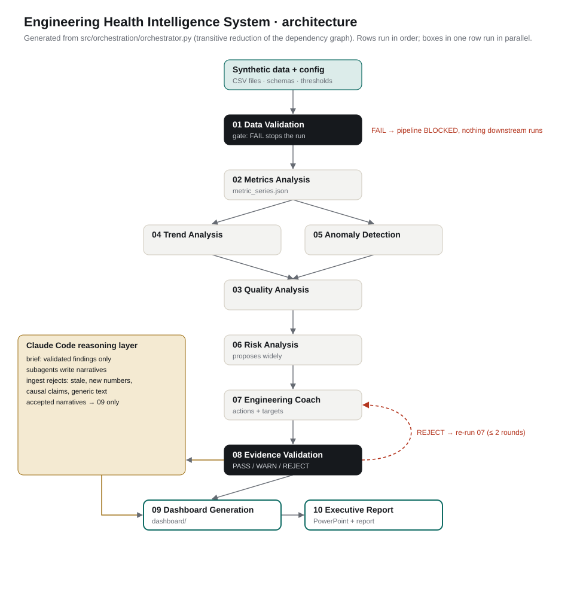
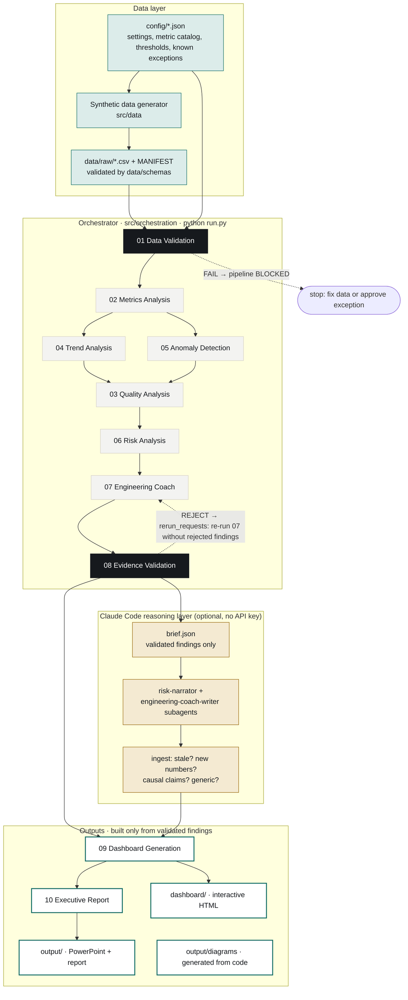
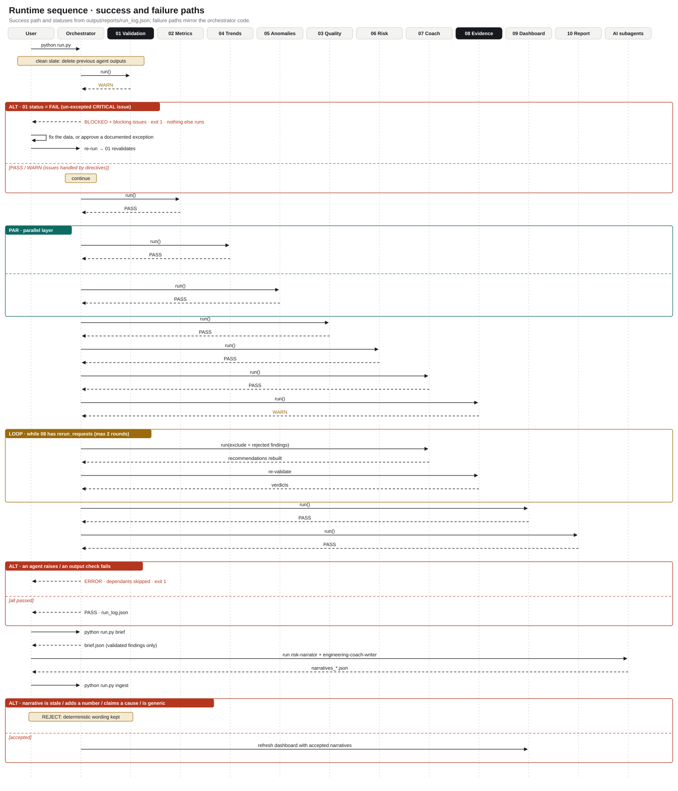
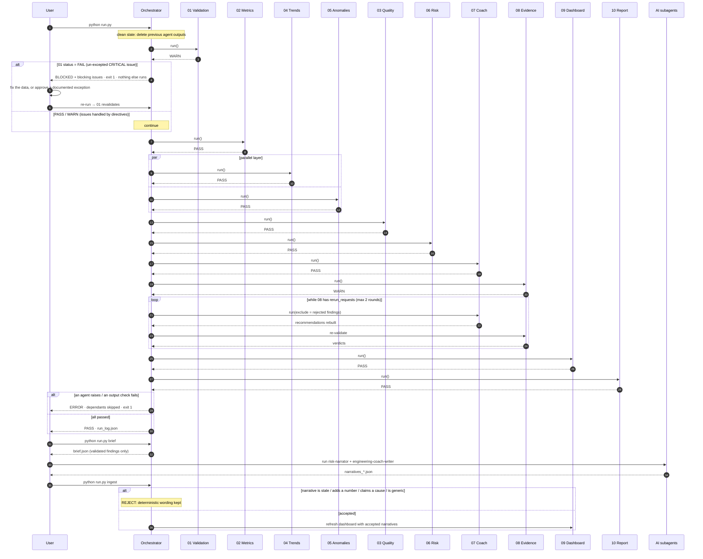

# Diagrams

_Generated by `python -m src.reporting.diagrams` from the orchestrator and the latest run log. Do not edit by hand._

## Architecture

```mermaid
flowchart TB
  classDef gate fill:#16191d,color:#fff,stroke:#16191d
  classDef agent fill:#f3f3f1,color:#16191d,stroke:#d6d1c6
  classDef data fill:#dcecea,color:#16191d,stroke:#0e6b63
  classDef out fill:#fff,color:#16191d,stroke:#0e6b63,stroke-width:2px
  classDef ai fill:#f4ead2,color:#16191d,stroke:#9a6a0c
  subgraph DATA["Data layer"]
    CFG["config/*.json<br/>settings, metric catalog, thresholds, known exceptions"]:::data
    GEN["Synthetic data generator<br/>src/data"]:::data
    RAW["data/raw/*.csv + MANIFEST<br/>validated by data/schemas"]:::data
  end
  CFG --> GEN --> RAW
  subgraph ORCH["Orchestrator · src/orchestration · python run.py"]
    A01["01 Data Validation"]:::gate
    A02["02 Metrics Analysis"]:::agent
    A04["04 Trend Analysis"]:::agent
    A05["05 Anomaly Detection"]:::agent
    A03["03 Quality Analysis"]:::agent
    A06["06 Risk Analysis"]:::agent
    A07["07 Engineering Coach"]:::agent
    A08["08 Evidence Validation"]:::gate
  end
  subgraph OUTPUTS["Outputs · built only from validated findings"]
    A09["09 Dashboard Generation"]:::out
    A10["10 Executive Report"]:::out
    DASH["dashboard/ · interactive HTML"]:::out
    DECK["output/ · PowerPoint + report"]:::out
    DIAG["output/diagrams · generated from code"]:::out
  end
  subgraph AI["Claude Code reasoning layer (optional, no API key)"]
    BRIEF["brief.json<br/>validated findings only"]:::ai
    SUB["risk-narrator +<br/>engineering-coach-writer subagents"]:::ai
    ING["ingest: stale? new numbers?<br/>causal claims? generic?"]:::ai
  end
  RAW --> A01
  CFG --> A01
  A01 --> A02
  A04 --> A03
  A05 --> A03
  A02 --> A04
  A02 --> A05
  A03 --> A06
  A06 --> A07
  A07 --> A08
  A08 --> A09
  A09 --> A10
  A08 -. "REJECT → rerun_requests: re-run 07 without rejected findings" .-> A07
  A01 -. "FAIL → pipeline BLOCKED" .-> GATEFAIL(["stop: fix data or approve exception"])
  A09 --> DASH
  A10 --> DECK
  A08 --> BRIEF --> SUB --> ING --> A09
```

## Runtime sequence

```mermaid
sequenceDiagram
  autonumber
  participant PU as User
  participant PO as Orchestrator
  participant P01 as 01 Validation
  participant P02 as 02 Metrics
  participant P04 as 04 Trends
  participant P05 as 05 Anomalies
  participant P03 as 03 Quality
  participant P06 as 06 Risk
  participant P07 as 07 Coach
  participant P08 as 08 Evidence
  participant P09 as 09 Dashboard
  participant P10 as 10 Report
  participant PC as AI subagents
  PU->>PO: python run.py
  Note over PO: clean slate: delete previous agent outputs
  PO->>P01: run()
  P01-->>PO: WARN
  alt 01 status = FAIL (un-excepted CRITICAL issue)
  PO-->>PU: BLOCKED + blocking issues · exit 1 · nothing else runs
  PU->>PU: fix the data, or approve a documented exception
  PU->>PO: re-run → 01 revalidates
  else PASS / WARN (issues handled by directives)
  Note over PO: continue
  end
  PO->>P02: run()
  P02-->>PO: PASS
  par parallel layer
  PO->>P04: run()
  P04-->>PO: PASS
  and
  PO->>P05: run()
  P05-->>PO: PASS
  end
  PO->>P03: run()
  P03-->>PO: PASS
  PO->>P06: run()
  P06-->>PO: PASS
  PO->>P07: run()
  P07-->>PO: PASS
  PO->>P08: run()
  P08-->>PO: WARN
  loop while 08 has rerun_requests (max 2 rounds)
  PO->>P07: run(exclude = rejected findings)
  P07-->>PO: recommendations rebuilt
  PO->>P08: re-validate
  P08-->>PO: verdicts
  end
  PO->>P09: run()
  P09-->>PO: PASS
  PO->>P10: run()
  P10-->>PO: PASS
  alt an agent raises / an output check fails
  PO-->>PU: ERROR · dependants skipped · exit 1
  else all passed
  PO-->>PU: PASS · run_log.json
  end
  PU->>PO: python run.py brief
  PO-->>PU: brief.json (validated findings only)
  PU->>PC: run risk-narrator + engineering-coach-writer
  PC-->>PU: narratives_*.json
  PU->>PO: python run.py ingest
  alt narrative is stale / adds a number / claims a cause / is generic
  Note over PO: REJECT: deterministic wording kept
  else accepted
  PO->>P09: refresh dashboard with accepted narratives
  end
```
